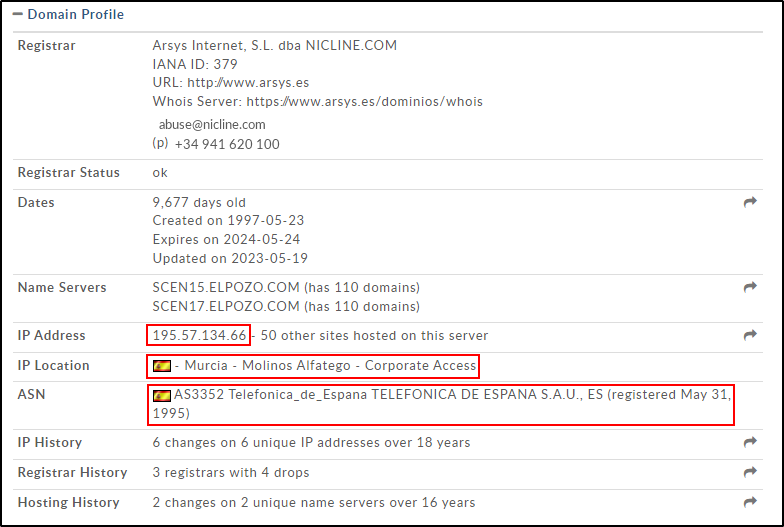
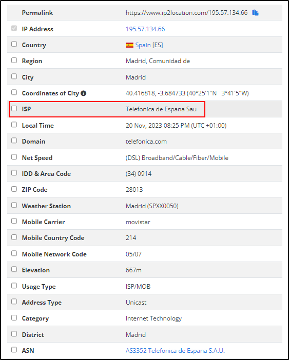
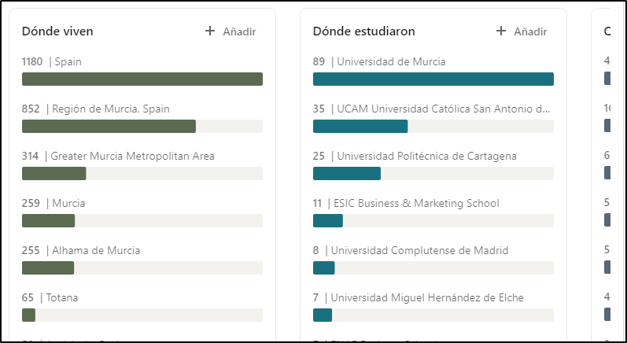
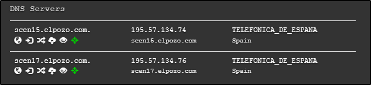
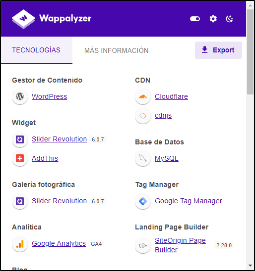
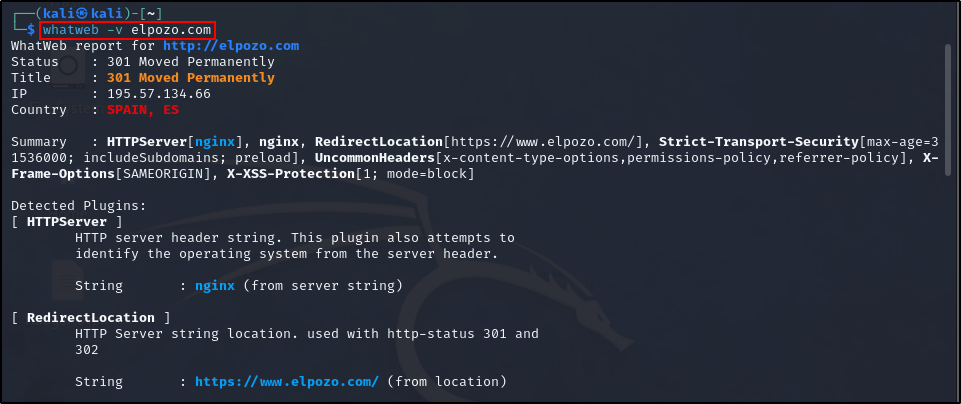
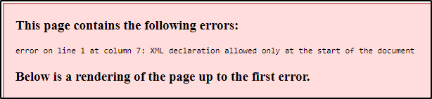
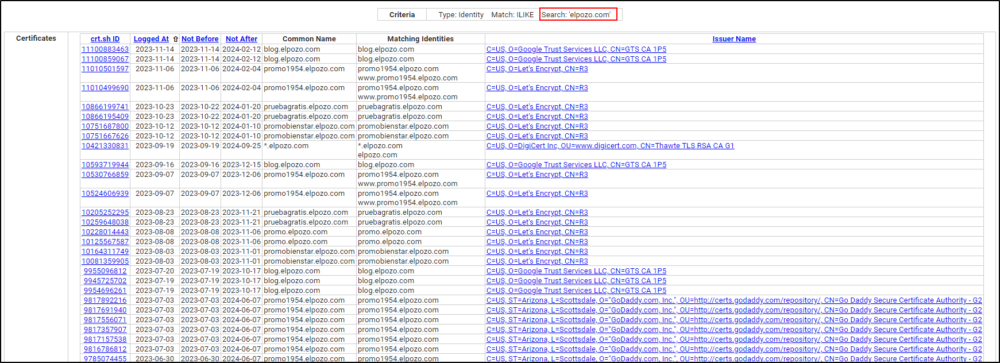

# A08 - Mapa DNS


**Autor:** Raúl Ladrón de Guevara García

---

## Índice


- [Mapa DNS](#mapa-dns)
  - [Índice](#índice)
  - [Introducción](#introducción)
  - [Información sobre la empresa](#información-sobre-la-empresa)
  - [1. Información Whois](#1-información-whois)
  - [2. Servidores DNS](#2-servidores-dns)
  - [3. Servidores de correo](#3-servidores-de-correo)
  - [4. Subdominios](#4-subdominios)
  - [5. Información Adicional](#5-información-adicional)
    - [Tecnologías](#tecnologías)
    - [Empleados](#empleados)
      - [Director general](#director-general)
      - [Director de comunicación](#director-de-comunicación)
      - [Director de Compras](#director-de-compras)
      - [Jefe Nacional Grandes Cuentas](#jefe-nacional-grandes-cuentas)
      - [Director de RR.HH](#director-de-rrhh)
      - [Director de Marketing](#director-de-marketing)
      - [Manager de Marketing](#manager-de-marketing)
      - [Departamento de informática](#departamento-de-informática)
      - [Digital Brand Manager](#digital-brand-manager)
      - [General Manager China Elpozo Shanghai](#general-manager-china-elpozo-shanghai)
      - [Core Category Manager Medios Productivos](#core-category-manager-medios-productivos)
    - [Registros SRV](#registros-srv)
    - [Robots.txt y Sitemap.xml](#robotstxt-y-sitemapxml)
    - [Certificados](#certificados)
  - [Justificación de la información obtenida](#justificación-de-la-información-obtenida)

## Introducción

En esta actividad llevaré a cabo la recopilación de información de la empresa “El POZO” sobre la infraestructura de la misma. Para ello, utilizaré técnicas y herramientas de OSINT (Open Source Intelligence) para recopilar todos los posibles datos de la empresa y de sus trabajadores.

## Información sobre la empresa

Buscando en internet podemos descubrir que se trata de una empresa española del sector de la alimentación que se dedica a la producción y comercialización de productos alimenticios, tanto carnes como productos elaborados y curados. Su sede principal se encuentra en Alhama de Murcia y forma parte del Grupo Fuertes, que también incluye a Procavi, Bodegas Luzón, Palancares, Cefusa, Agrifusa, Fripozo, Sediasa y Aquadeus.

Su página web es: https://www.elpozo.com/
La empresa utiliza las siguientes plataformas para ofrecer información y promocionar sus productos:
- **Facebook:** https://www.facebook.com/ElPozoAlimentacion/
- **Instagram:** https://www.instagram.com/elpozoalimentacion/
- **Twitter:** https://twitter.com/ElPozoAlimenta
- **YouTube:** https://www.youtube.com/c/ElPozoAlimentaci%C3%B3nvideos


## 1. Información Whois

Para recopilar la información Whois de la empresa he utilizado las herramientas **whois.domaintools.com** (https://whois.domaintools.com/), **whois** (En Kali Linux) y **who.is** (https://who.is) de las cuales la que mayor información me ha ofrecido ha sido **whois.domaintools.com** en la que podemos observar la dirección IP pública del dominio (195.57.134.66), la localización de dicha IP (Murcia - Molinos Alfatego - Corporate Access) y el ASN (AS3352 Telefonica de España S.A.U. (Registrada el 31 de Mayo de 1995)):



Para descubrir el ISP (Proveedor de servicios de internet) de la empresa he utilizado la herramienta **IP2LOCATION** (https://www.ip2location.com/) y he realizado una busqueda a través de la dirección IP pública obtenida anteriormente:



Como podemos ver en la captura de arriba también nos ha ofrecido información sobre el dominio de la compañia (telefonica.com), el tipo de dirección IP (Unicast), la velocidad del internet contratado por la empresa ((DSL) Broadband/Cable/Fiber/Mobile), el código de ciudad de los móviles que utiliza la empresa (214), etc...

Buscando en su página web he podido localizar algunos teléfonos de contacto para comerciales y clientes y un correo electrónico y una dirección de correo postal:

**Teléfonos para comerciales:**

- Centralita: 968 636 800

- Elaborados: 968 636 830

- Carnes Frescas: 968 636 850

**Teléfonos, correo electrónico y dirección postal para consumidores:**

- Centralita: 968 636 800
 
- Atención al cliente: 900 120 210

- Correo: consumidores@elpozo.com

- Dirección postal: ELPOZO ALIMENTACIÓN S.A. Avda. Antonio Fuertes, nº1 
30840 - Alhama de Murcia - Murcia

Con la ayuda de la herramienta **hunter.io** he podido detectar algunos correos electrónicos de contacto:

- elpozo@elpozo.com
- personal@elpozo.com
- exporta@elpozo.com
- comunicacion@elpozo.com
- asturias@elpozo.com
- bienstar@elpozo.com

A través de su cuenta oficial de Linkedin se puede ver que el tamaño de la empresa ronda de los 1001 a los 5000 empleados de los cuales 1241 empleados tienen perfil en Linkedin y se pueden ver donde viven, donde estudiaron y que trabajo desempeñan dentro de la empresa:




## 2. Servidores DNS

Una vez recolectada toda la información inicial sobre la empresa, he utilizado las herramientas **DNSRECON** y **DNSDumpster** para recolectar toda la información posible sobre los servidores DNS del dominio elpozo.com. En el caso de la herramienta **DNSRECON** la he utilizado con el siguiente comando:

```dnsrecon -d elpozo.com```

Utilizando la herramienta **DNSDumpster** simplemente he introducido el dominio en su página web: https://dnsdumpster.com/

Utilizando cada una de las herramientas los sevidores DNS que he podido encontrar son los siguientes:

**DNSRECON:**
```
- scen17.elpozo.com -> 195.57.134.76

- scen17.elpozo.com -> 195.57.134.76
```
**DNSDumpster:**




## 3. Servidores de correo

Para encontrar los servidores de correo asociados al dominio **elpozo.com** he utilizado las mismas herramientas y comandos que para los servidores DNS, esta vez **DNSRECON** me ha dado un mejor resultado mostrándome los siguientes servidores de correo con sus IP's:

```
- elpozo-com.mail.protection.outlook.com -> 52.101.73.30

- elpozo-com.mail.protection.outlook.com -> 52.101.68.0

- elpozo-com.mail.protection.outlook.com -> 52.101.73.12

- elpozo-com.mail.protection.outlook.com -> 52.101.68.18

- elpozo-com.mail.protection.outlook.com -> 52.101.73.26

- elpozo-com.mail.protection.outlook.com -> 52.101.73.11

- elpozo-com.mail.protection.outlook.com -> 52.101.73.2
```

## 4. Subdominios

Para encontrar todos los subdominios relacionados con el dominio principal de la empresa El Pozo he utilizado las herramientas **Sublist3r** y **Amass**.

Para utilizar la herramienta **Sublist3r** he ejecutado el siguiente comando en Kali Linux:
```
python sublist3r.py -v -d elpozo.com -t 5
```

Del cual se han obtenido 26 subdominios:

```
- ac.elpozo.com
- autodiscover.elpozo.com
- bienstar.elpozo.com
- www.bienstar.elpozo.com
- bienstar2.elpozo.com
- blog.elpozo.com
- boletines.elpozo.com
- china.elpozo.com
- www.china.elpozo.com
- correo.elpozo.com
- empanados.elpozo.com
- www.empanados.elpozo.com
- cpanel.empanados.elpozo.com
- cpcalendars.empanados.elpozo.com
- cpcontacts.empanados.elpozo.com
- mail.empanados.elpozo.com
- webdisk.empanados.elpozo.com
- webmail.empanados.elpozo.com
- mail.elpozo.com
- promo.elpozo.com
- promo1954.elpozo.com
- www.promo1954.elpozo.com
- promobienstar.elpozo.com
- pruebagratis.elpozo.com
- ruta1954.elpozo.com
- www.ruta1954.elpozo.com
```

Para utilizar la herramienta **Amass** se ha utilizado el siguiente comando: 

```
amass enum -passive -d elpozo.com 
```

Como la salida generada por el comando es demasiado grande he decido exportarla a un fichero csv añadiendole el parámetro -o al comando: 

```
amass enum -passive -d elpozo.com -o resultados_amass.csv
```
Estos resultados los he subido al mismo repositorio de GitHub: [enlace](https://github.com/rladgar/Hacking-etico/blob/main/A08-MapaDNS/Datos/resultados_amass.csv)


## 5. Información Adicional

Ahora pasaré a buscar más información relevante sobre la empresa como las tecnologías que usa el dominio, información de los jefes y empleados de la empresa, correos electrónicos, cuentas en distintas plataformas, certificados, etc...

### Tecnologías

Para descubrir las tecnologías que utiliza el dominio he utilizado las herramientas **Wappalizer** y **Whatweb**:

Para utilizar **Wappalizer** simplemente pulsamos en el icono de la extensión y nos muestra los resultados:



En el caso de **Whatweb** ejecuto el siguiente comando en Kali Linux:

```
whatweb -v elpozo.com
```



Tecnologías encontradas que a mi parecer tienen más relevancia y por las que podríamos atacar a la empresa:

**Gestor de contenido:** WordPress

**WordPress plugins:**
- SiteOrigin Widgets Bundle
- SiteOrigin Page Builder - 2.28.0
- Contact Form 7 - 5.8.3
- WPML - 4.6.7
  
**Widgets:** 
- Slider Revolution - 6.0.7
- AddThis

**Galería fotográfica:** Slider Revolution - 6.0.7

**Analítica:** Google Analytics - GA4

**Blog:** WordPress

**Framework JavaScript:** GSAP - 1.15.1

**Librerías JavaScript:**
- ScrollMagic - 2.0.5
- Lightbox
- core-js - 3.31.0
- Modernizr - 2.7.1
- jQuery - 2.2.4

**Base de datos:** MySQL

**UI Frameworks:** Bootstrap - 3.3.6

**Seguridad:**
- reCAPTCHA
- HSTS

**Servidor/Proxy:** Nginx

**Lenguaje de programación:** PHP

### Empleados

Para recaudar toda la información posible sobre los empleados he realizado una búsqueda exhaustiva en **Linkedin**, he utilizado la extensión **ClearBit Connect** para obtener más información y la herramienta **hunter.io** para sacar correos electrónicos de los empleados. Como en la empresa hay más de 1000 empleados he decido poner los cargos más importantes de la misma:

---

#### Director general

- **Nombre:** Rafael Fuertes

- **Localización:** Murcia, España

---

#### Director de comunicación

- **Nombre:** José Ángel Cerón

- **Localización:** Murcia, España

- **Cuenta de Linkedin:** https://www.linkedin.com/in/jos%C3%A9-%C3%A1ngel-cer%C3%B3n-7591344a/

---

#### Director de Compras

- **Nombre:** Constantino Sánchez

- **Localización:** Murcia, España

---

#### Jefe Nacional Grandes Cuentas

- **Nombre:** Pedro Ramon Martinez

- **Localización:** Murcia, España

- **Cuenta de Linkedin:** https://www.linkedin.com/in/pedro-ramon-martinez-04b19055/

---

#### Director de RR.HH

- **Nombre:** Manuel García

- **Localización:** Murcia, España

- **Cuenta de Linkedin:** https://www.linkedin.com/in/mgjuesas/

---

#### Director de Marketing

- **Nombre:** Julián González García

- **Correo electrónico empresa:** 
julian.garcia@elpozo.com

- **Localización:** Murcia, España

- **Cuenta de Linkedin:** https://www.linkedin.com/in/juli%C3%A1n-gonz%C3%A1lez-garc%C3%ADa-4ba78476/

---

#### Manager de Marketing

- **Nombre:** Cristina Sanchez Sanchez

- **Correo electrónico:** cristina.sanchez@elpozo.com

- **Localización:** Murcia, España

- **Cuenta de Linkedin:** https://www.linkedin.com/in/cristina-sanchez-sanchez-58b00a187/

---

#### Departamento de informática

- **Nombre:** Roque Navarro

- **Correo electrónico:** roque.navarro@elpozo.com

- **Localización:** Murcia, España

- **Cuenta de Linkedin**: https://www.linkedin.com/in/roque-navarro-2a659051/

---

#### Digital Brand Manager

- **Nombre:** Alfonso Rubio Corral

- **Cumpleaños:** 26 de agosto

- **Correo electrónico empresa:** alfonso.corral@elpozo.com

- **Localización:** Murcia, España

- **Cuenta de Linkedin:** https://www.linkedin.com/in/salvador-lucas-0b466656/

- **Cuenta de Instagram:** https://www.instagram.com/alfonsojrc/

- **Cuenta de Twitter:** https://twitter.com/Alfonsojrc

---

#### General Manager China Elpozo Shanghai

- **Nombre:** Xianfan Xu

- **Correo electrónico empresa:** xianfan.xu@elpozo.com

- **Correo electrónico personal:** angelxu92@gmail.com

- **Localización:** Shanghái, China

- **Cuenta de Linkedin:** https://www.linkedin.com/in/xianfan-xu-b1918b93/

---

#### Core Category Manager Medios Productivos

- **Nombre:** Salvador Lucas

- **Correo electrónico empresa:** salvador.lucas@elpozo.com

- **Localización:** Murcia, España

- **Cuenta de Linkedin:** https://www.linkedin.com/in/salvador-lucas-0b466656/

---

### Registros SRV

Estos registros nos dan conocimiento sobre los servicios que ofrece el dominio. En este caso utilizando la herramienta **DNSRECON** he podido descubrir 2 de ellos:

```
SRV _sipfederationtls._tcp.elpozo.com sipfed.online.lync.com 52.112.191.65 5061
SRV _sip._tls.elpozo.com sipdir.online.lync.com 52.112.192.11 443
```
 
### Robots.txt y Sitemap.xml

Para recolectar esta información he utilizado simplemente el navegador como herramienta para extraer los datos:

El archivo **robots.txt** indica a que directorios podemos acceder y a cuáles no. En este caso no hay mucha información:

```
 User-agent: *
Disallow: /wp-admin/
Disallow: */?s=*

Sitemap: https://www.elpozo.com/sitemap.rss
```
**Sitemap.xml** es el archivo que contiene todas y cada una de las páginas (URL's) de una web.

En este caso no se puede inspeccionar ya el fichero contiene un error:




### Certificados

Para la obtención de los certificados he utilizado la herramienta **crt.sh** indicando el dominio de la empresa:



Existen muchos certificados que pertenecen al dominio si se quieren ver todos haga clic
[aquí](https://crt.sh/?q=elpozo.com)

## Justificación de la información obtenida

Toda la información que he obtenido sobre la empresa, sus empleados, tecnologías y servicios que usan, etc… es una información bástate relevante para la auditoria en sí ya que con ella tenemos una base de lo que le podemos hacer a la empresa.

Con toda la información que he recolectado sobre los empleados podría por ejemplo utilizar sus correos electrónicos para realizarles ataques de phising y así obtener sus credenciales para acceder a más servicios de la empresa. También una posibilidad es la creación de un sock puppet (perfil falso) con el que pueda acercarme más a estos empleados o incluso contactar con la empresa para obtener más información.

Y, en el caso de los servidores y tecnologías, podríamos detectar vulnerabilidades en algunas de sus versiones y obtener acceso a ellos para obtener control sobre el mismo y recaudar más información.
